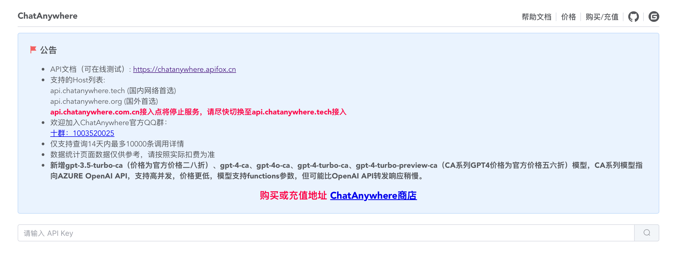
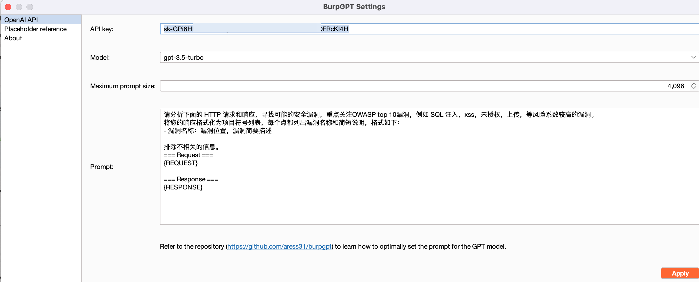
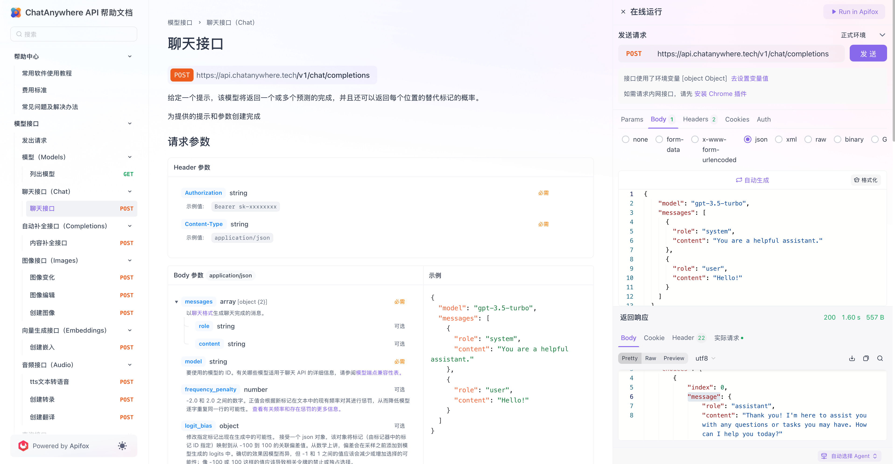

# burpGPT2
burpGPT二开(应付领导)。原项目：https://github.com/aress31/burpgpt

## 特点

相较于社区版，有以下特点：

1. 增加GPT-3.5-turbo 大模型（社区版的 model 已经过期无法使用）
2. 使用国内 API 中转，保证网络速度可用
3. 不花钱

## 接口

使用https://chatanywhere.apifox.cn来做中转，从这获得一个 key




burp 加载后，会在工具上方有一个单独的 burpGPT 的选项栏，点进去配置：

```
请分析下面的 HTTP 请求和响应，寻找可能的安全漏洞，重点关注OWASP top 10漏洞，例如 SQL 注入，xss，未授权，上传，等风险系数较高的漏洞。
将您的响应格式化为项目符号列表，每个点都列出漏洞名称和简短说明，格式如下：
- 漏洞名称：漏洞位置，漏洞简要描述

排除不相关的信息。
=== Request ===
{REQUEST}

=== Response ===
{RESPONSE}
```




插件功能主要是分析请求的数据包。包括被动请求扫描，主动请求扫描。需要测试人员在 web 页面先进行点击、输入等，才能进行请求

然后使用被动扫描功能即可。

接口是https://chatanywhere.apifox.cn/api-92222076 有需要自己改代码